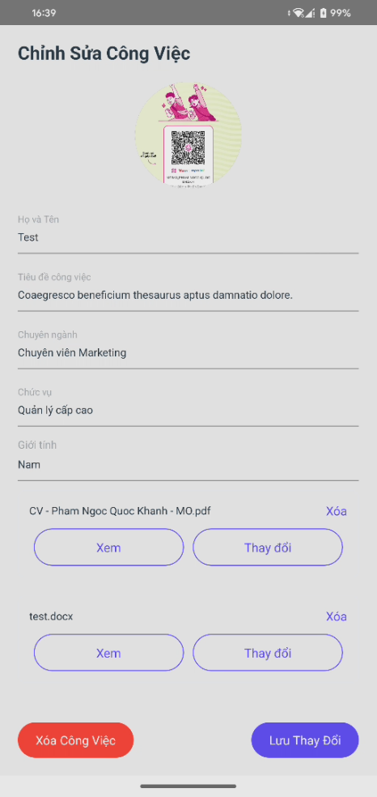

# Ứng dụng di động Quản lý Công việc (Task Manager Mobile App)


Đây là ứng dụng di động client-side cho hệ thống Quản lý Công việc, được xây dựng bằng React Native. Ứng dụng này kết nối với [Task Manager Backend API](https://github.com/khanh29204/task_manager_be) để thực hiện các thao tác quản lý dữ liệu.

## Mục lục

- [Tính năng nổi bật](#tính-năng-nổi-bật)
- [Ảnh chụp màn hình](#ảnh-chụp-màn-hình)
- [Công nghệ sử dụng](#công-nghệ-sử-dụng)
- [Yêu cầu](#yêu-cầu)
- [Hướng dẫn cài đặt và khởi chạy](#hướng-dẫn-cài-đặt-và-khởi-chạy)
  - [1. Tải mã nguồn](#1-tải-mã-nguồn)
  - [2. Cài đặt Dependencies](#2-cài-đặt-dependencies)
  - [3. Cấu hình API Endpoint](#3-cấu-hình-api-endpoint)
  - [4. Cài đặt môi trường Native](#4-cài-đặt-môi-trường-native)
  - [5. Chạy ứng dụng](#5-chạy-ứng-dụng)
- [Các scripts có sẵn](#các-scripts-có-sẵn)
- [Cấu trúc thư mục](#cấu-trúc-thư-mục)

## Tính năng nổi bật

- **Quản lý công việc (CRUD):** Giao diện trực quan để xem danh sách, thêm, sửa, xóa công việc.
- **Quản lý trạng thái tập trung:** Sử dụng **Redux Toolkit** để quản lý trạng thái ứng dụng một cách hiệu quả và dễ đoán.
- **Lưu trữ dữ liệu Offline:** Tích hợp **Redux Persist** và **MMKV** để lưu trữ dữ liệu, cho phép người dùng xem lại thông tin ngay cả khi không có mạng.
- **Tìm kiếm & Lọc:** Tìm kiếm công việc theo tên, chuyên ngành. Lọc theo giới tính và trạng thái hoàn thành. Tối ưu hóa hiệu năng tìm kiếm bằng `useDebounce`.
- **Upload và Quản lý File:**
  - Hỗ trợ chọn ảnh từ thư viện hoặc chụp ảnh mới để làm avatar.
  - Cho phép chọn các file tài liệu (PDF, DOCX,...) để đính kèm.
  - Tải file lên server và hiển thị.
- **Xem File:** Tích hợp tính năng xem trước các file đã tải lên (PDF, ảnh,...) ngay trong ứng dụng.
- **Giao diện người dùng hiện đại:** Xây dựng với thư viện component **React Native UI Lib**.
- **Thông báo & Trạng thái mạng:** Hiển thị thông báo (thành công, lỗi) và cảnh báo khi mất kết nối mạng.

## Ảnh chụp màn hình

|        Màn hình chính (Home)        |        Chi tiết công việc (Detail)        |          Thêm công việc (Add)          |
| :---------------------------------: | :---------------------------------------: | :------------------------------------: |
|  |  |  |

## Công nghệ sử dụng

- **Framework:** React Native
- **Ngôn ngữ:** TypeScript
- **Quản lý trạng thái:** Redux Toolkit, React Redux
- **Lưu trữ Offline:** Redux Persist, React Native MMKV
- **Điều hướng:** React Navigation (Native Stack)
- **UI Components:** React Native UI Lib
- **Networking:** Axios
- **Quản lý File & Ảnh:** `react-native-image-picker`, `react-native-document-picker`, `react-native-file-viewer`
- **Quản lý package:** Yarn

## Yêu cầu

- **Node.js**: `v18.x` hoặc cao hơn.
- **Yarn**: `v1.x`.
- **Môi trường React Native CLI**: Đã cài đặt đầy đủ theo [hướng dẫn chính thức](https://reactnative.dev/docs/environment-setup).
  - **Android**: Android Studio, JDK, Android SDK.
  - **iOS**: Xcode, CocoaPods.
- **Backend Server**: Cần có một instance của [Task Manager Backend API](https://github.com/khanh29204/task_manager_be) đang hoạt động.

## Hướng dẫn cài đặt và khởi chạy

### 1. Tải mã nguồn

```bash
git clone https://github.com/khanh29204/task_manager_app.git
cd task_manager_app
```

### 2. Cài đặt Dependencies

Sử dụng Yarn để cài đặt tất cả các gói cần thiết từ `package.json`.

```bash
yarn install
```

### 3. Cấu hình API Endpoint

Mở file `src/utils/axios_instance.ts` và thay đổi giá trị của `BASE_URL` thành địa chỉ IP hoặc domain của backend server của bạn.

```typescript
// src/utils/axios_instance.ts

// Thay đổi URL này thành địa chỉ API backend của bạn
export const BASE_URL = 'http://<IP_MAY_CUA_BAN>:3000';
// Ví dụ: export const BASE_URL = 'http://192.168.1.10:3000';
```

### 4. Cài đặt môi trường Native

- **Đối với iOS:**

  ```bash
  cd ios
  pod install
  cd ..
  ```

- **Đối với Android:**
  Tạo file `android/local.properties` (nếu chưa có) và trỏ đến thư mục SDK của bạn.
  ```properties
  # android/local.properties
  sdk.dir=/Users/TEN_NGUOI_DUNG/Library/Android/sdk
  ```

### 5. Chạy ứng dụng

Mở hai cửa sổ terminal riêng biệt:

1.  **Khởi động Metro Bundler:**

    ```bash
    yarn start
    ```

2.  **Chạy trên thiết bị/máy ảo:**
    - **iOS:**
      ```bash
      yarn ios
      ```
    - **Android:**
      ```bash
      yarn android
      ```

## Các scripts có sẵn

| Script               | Mô tả                                                     |
| -------------------- | --------------------------------------------------------- |
| `yarn android`       | Build và chạy ứng dụng trên máy ảo/thiết bị Android.      |
| `yarn ios`           | Build và chạy ứng dụng trên máy ảo/thiết bị iOS.          |
| `yarn build`         | Build apk và cài đặt lên thiết bị hiện đang được kết nối. |
| `yarn start` / `dev` | Khởi động Metro, bundler cho React Native.                |
| `yarn lint`          | Chạy ESLint để kiểm tra lỗi và format code.               |
| `yarn test`          | Chạy các unit test với Jest.                              |

## Cấu trúc thư mục

```
task_manager_app-main/
├── android/                  # Mã nguồn native cho Android
├── ios/                      # Mã nguồn native cho iOS
├── src/                      # Thư mục chứa mã nguồn chính của ứng dụng
│   ├── components/           # Các component tái sử dụng
│   ├── dialog/               # Các component dạng dialog/popup
│   ├── hooks/                # Các custom hooks (useDebounce, useTaskForm)
│   ├── models/               # Định nghĩa các interface/type cho dữ liệu
│   ├── navigation/           # Cấu hình điều hướng (React Navigation)
│   ├── redux/                # Cấu hình Redux (actions, slices, store)
│   │   ├── action/           # Các thunk actions
│   │   ├── api/              # Các hàm gọi API
│   │   └── slice/            # Các Redux slices
│   ├── screens/              # Các màn hình chính của ứng dụng
│   └── utils/                # Các hàm tiện ích (axios, xử lý file,...)
├── App.tsx                   # Component gốc của ứng dụng
├── package.json              # Quản lý dependencies và scripts
└── tsconfig.json             # Cấu hình TypeScript
```
